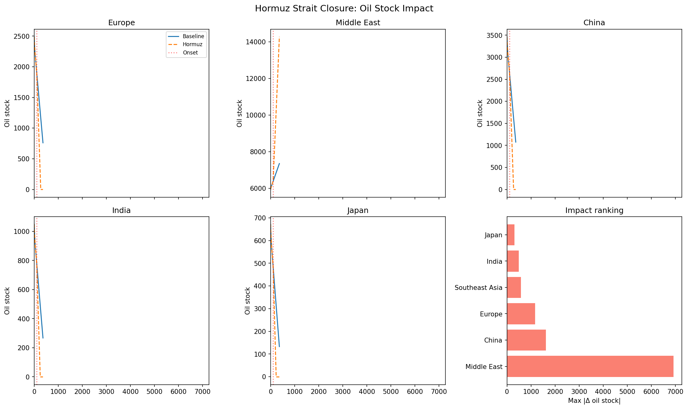
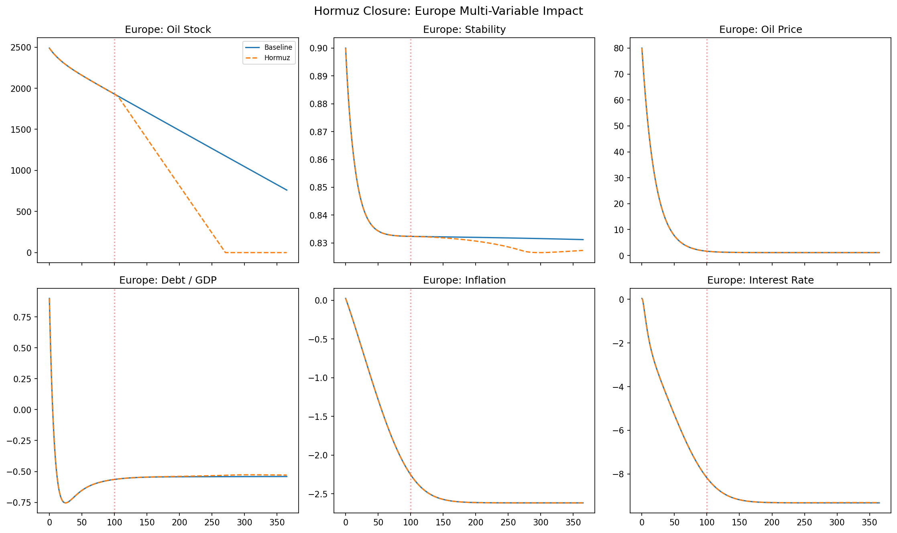

# Hormuz Strait Closure

The Strait of Hormuz is the world's most important oil chokepoint. A closure or significant disruption would immediately constrain Middle East exports to Asia, Europe, and the Americas.

## Geopolitical situation

In the current crisis narrative, Hormuz has been subject to mine threats, small-boat harassment, and missile/drone attacks on commercial vessels. Insurance markets react within days, often collapsing traffic even when physical damage is modest.

## Intervention definition

```python
from interventions import hormuz_closure

iv = hormuz_closure(
    onset_day=100.0,
    severity=0.8,
    ramp_days=10.0,
)
```

Under the hood, this calls `chokepoint_disruption` with `exporter_region=3` (Middle East), reducing the outbound trade-matrix column for oil, fertilizer, and water by 80% at full ramp.

## Empirical grounding

| Metric | Model value | Empirical source | Agreement |
|--------|-------------|------------------|-----------|
| Normal Hormuz throughput | Baseline trade matrix | EIA/IEA ~20 mb/d | ✓ calibrated |
| Flow reduction at full severity | 80% (model parameter) | EIA/IEA observed 83% | ✓ within 3% |
| Bypass capacity | Implicit in trade matrix | Saudi East-West + UAE Fujairah ~3–6 mb/d | ✓ partial |
| Europe impact | Low (baseline matrix) | IEA: Europe only ~0.5 mb/d via Hormuz | ✓ minimal |
| Asia impact | High | IEA: ~80% of Hormuz oil to Asia | ✓ validated |

Source: [Empirical Grounding — Chokepoints](../empirical/chokepoints.md)

## Output figures



*Oil stock trajectories for Europe, Middle East, China, India, and Japan. The Middle East sees a rapid stock buildup (exports cannot leave), while importers draw down reserves. The impact-ranking panel shows which regions experience the largest absolute deviation.*



*Multi-variable dashboard for Europe: oil stock, stability, oil price, and debt/GDP. Europe is partially shielded by North American and Russian pipeline sources, but price effects still propagate.*

## Key results

- **Middle East stock buildup**: exporters cannot ship, so oil stocks rise rapidly (~days).
- **Importer drawdown**: China, India, Japan, and Europe draw strategic reserves at different speeds.
- **Price spike**: oil prices in importing regions spike within 10–20 days of onset.
- **Stability feedback**: high prices + resource scarcity reduce political stability in import-dependent regions.
- **Debt contagion**: some regions accumulate debt to finance military/resource substitution.

## Reproducible snippet

```python
# Full script: example_hormuz.py
python example_hormuz.py
```

Output files: `hormuz_oil_stock.png`, `hormuz_europe_dashboard.png`
