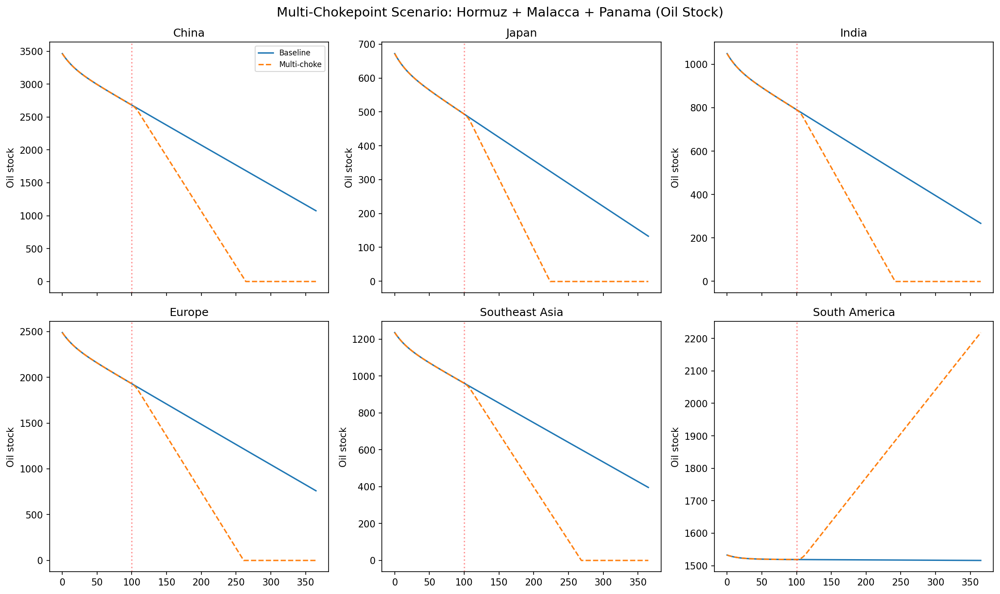
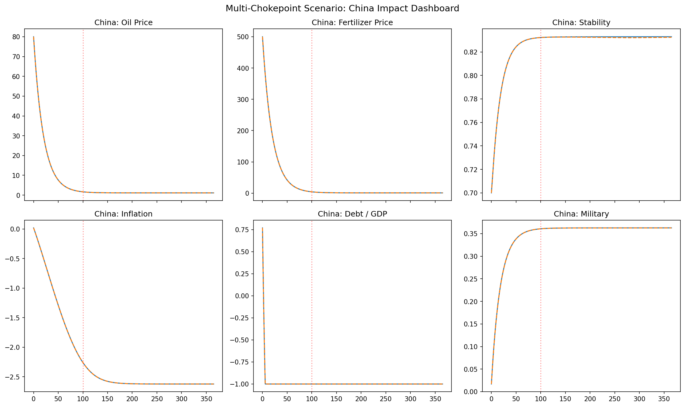

# Multi-Chokepoint (GT#21)

Game Theory #21 argues that the U.S. strategy is to control *multiple* global chokepoints—Hormuz, Malacca, Panama, Gibraltar—to contain China and force global dependency on North American resources.

## Intervention definition

```python
from interventions import hormuz_closure, malacca_disruption, panama_disruption, compose_interventions

iv = compose_interventions([
    hormuz_closure(onset_day=100.0, severity=0.8, ramp_days=10.0),
    malacca_disruption(onset_day=100.0, severity=0.7, ramp_days=14.0),
    panama_disruption(onset_day=100.0, severity=0.6, ramp_days=14.0),
])
```

## Empirical grounding

| Mechanism | Empirical basis | Model parameterization |
|-----------|----------------|------------------------|
| Hormuz closure | EIA/IEA 83% observed reduction | `severity=0.8`, `ramp_days=10` |
| Malacca closure | ANRPC: ~48% China imports via Malacca | `severity=0.7`, `ramp_days=14` |
| Panama closure | EIA: ~2.5–3% seaborne oil; >95% US LPG | `severity=0.6`, `ramp_days=14` |
| Combined China trap | Derived: ~60–70% of China's oil imports | Compound effect of three closures |

## Output figures



*Oil stock trajectories for China, Japan, India, Europe, Southeast Asia, and South America. The compound shock produces deeper and more persistent drawdowns than any single chokepoint.*



*China dashboard: oil price, fertilizer price, stability, inflation, debt/GDP, and military expenditure. All six variables deviate sharply from baseline, with debt and inflation showing the largest relative changes.*

## Key results

- **Compounding > additive**: the simultaneous closure produces larger impacts than the sum of individual closures because rerouting options are exhausted.
- **China impact**: the most severe of any scenario in the library. Oil stocks fall to critical levels, stability drops, and debt/GDP rises rapidly.
- **Surplus regions**: North America and Russia/CIS gain relative economic and political weight.
- **Europe**: partially shielded by pipeline and North American sources, but still experiences price spikes.
- **Model caveat**: the ASEAN net-exporter assumption in the trade matrix means the model may underestimate Malacca's real-world impact. See [Rejected / Unverified](../empirical/rejected.md).

## Reproducible snippet

```bash
python example_multi_chokepoint.py
```

Output files: `multi_chokepoint_oil.png`, `multi_chokepoint_china.png`
