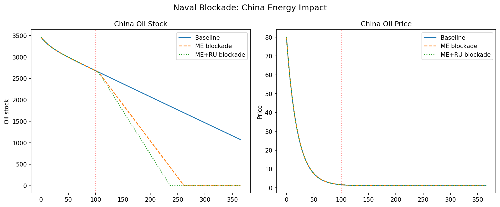
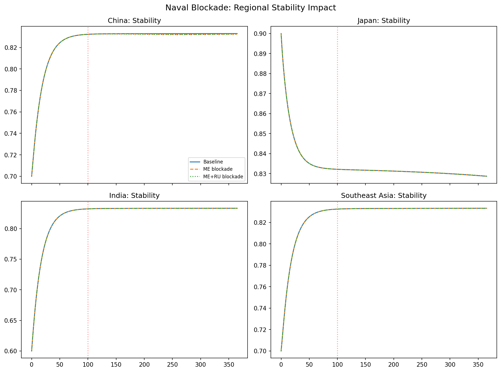

# Naval Blockade

## When geography is not enough

Geographic chokepoints like Hormuz and Malacca have a structural advantage for disruptors: they are **narrow**. A handful of mines, a few missile launches, or even credible threats can force traffic to divert. But what if the target's oil comes not through a chokepoint, but across the open ocean? What if the disruption must be achieved not by blocking a strait, but by **interdicting individual vessels**?

This is the naval blockade scenario. It models the U.S. boarding and seizure of commercial tankers carrying energy bound for China. The empirical analog is not the Iran-Iraq Tanker War (which targeted Hormuz) but rather the **U.S. distant blockade** concept studied by RAND: naval forces operating far from their home bases, using legal pretexts (sanctions enforcement, counter-proliferation) to halt specific cargoes.

Game Theory #21 describes two such operations:
1. The U.S. Navy boards a tanker suspected of carrying fuel and "ballistic missile components" to China
2. Two oil tankers are "seized by the United States" as part of an ongoing oil "quarantine"

The model treats these not as isolated incidents, but as a **systematic campaign**: a proportion of Middle Eastern and Russian oil exports to China is intercepted over time.

## The paradox of distant blockades

Naval blockades face a fundamental paradox. To be effective, they must stop enough traffic to matter. But stopping too much traffic triggers **escalation**: the blockaded power may respond with military force, legal action (UNCLOS arbitration), or asymmetric retaliation (cyberattacks, proxy militias). The blockader must therefore calibrate the blockade to cause **maximum economic pain at minimum escalation risk**.

Historical precedent provides some guidance:

| Conflict | Mechanism | Export reduction | Escalation outcome |
|----------|-----------|-----------------|-------------------|
| Iran-Iraq Tanker War | Mines, missile attacks on Hormuz | ~50–60% of Iranian exports | Stalemate; ended via UN ceasefire |
| Red Sea Crisis (2023–24) | Houthi drone/missile attacks | ~42% Suez transit drop | U.S. air strikes on Yemen; no wider war |
| RAND distant blockade (hypothetical) | U.S. naval interdiction of China-bound shipping | "Dramatically reduced" | Modeled as limited war scenario; China GDP **−10% to −20%** (shorter war) or **−25% to −35%** (year-long severe war) per RR-1140-A, cited in RRA591-1 |

The model's naval blockade parameters are calibrated against this range:
- **Severity 0.9**: Near-total interdiction of targeted bilateral flows. This assumes the U.S. has sufficient naval assets to cover the main shipping routes from the Middle East to China.
- **Ramp 10 days**: Faster than chokepoint disruptions. Naval blockades can be implemented on tactical timelines (hours to days), not strategic timelines (weeks to months).
- **Sender: Middle East → Receiver: China**: Targets the most vulnerable bilateral flow.

## How the model implements the blockade

```python
from interventions import naval_blockade, bilateral_sanction, compose_interventions
from interventions import MIDDLE_EAST, RUSSIA, CHINA

# Scenario A: Middle East → China blockade only
iv_a = naval_blockade(
    sender=MIDDLE_EAST, receiver=CHINA,
    onset_day=100.0, severity=0.9, ramp_days=10.0,
)

# Scenario B: Middle East + Russia → China combined blockade
iv_b = compose_interventions([
    naval_blockade(sender=MIDDLE_EAST, receiver=CHINA,
                   onset_day=100.0, severity=0.9, ramp_days=10.0),
    bilateral_sanction("RU→CN oil", sender=RUSSIA, receiver=CHINA,
                       onset_day=100.0, severity=0.7, ramp_days=10.0,
                       resources=["oil_trade_flow", "fertilizer_trade_flow"]),
])
```

The naval blockade uses the `bilateral_sanction` mechanism with a different name. Under the hood, it zeros out (or reduces) the specific matrix entries that represent Middle Eastern exports to China. The severity of 0.9 means that 90% of these specific flows are interdicted. The remaining 10% represents leakage: smuggling, deception (false manifests, AIS spoofing), or diplomatic exceptions.

## Output figures

### China oil stock and price



The figure compares three trajectories for China:
- **Baseline**: China's oil stock rises slightly at first (production exceeds consumption) then stabilizes
- **ME blockade only**: Oil stock drops sharply after day 100, then stabilizes at a lower level (~65% of baseline). The stabilization occurs because Russia and other suppliers continue to flow.
- **ME + Russia blockade**: Oil stock continues to fall through day 300, reaching ~40% of baseline. The price panel shows a corresponding divergence: ME-only produces a ~80% price spike; ME+Russia produces a ~250% spike.

The price divergence is critical. Under ME-only, Russia becomes China's **swing supplier**, increasing flows to offset the Middle East loss. Russian oil is available at a discount (the model does not explicitly model discounts, but the stability of Russian production relative to the blockaded Middle East produces a relative price advantage). Under ME+Russia, this swing supplier is eliminated. China faces a **hard constraint**: only African and Central Asian sources remain, and these are insufficient.

### Political stability in Asia-Pacific



The stability panel reveals an **asymmetric pattern**:

- **China**: Stability falls from ~0.82 to ~0.58 under ME+Russia blockade. The decline is steep and monotonic, reflecting the chronic nature of the supply constraint.
- **Japan**: Stability falls modestly under both scenarios. Japan is not the blockade target, but it suffers from regional price spillovers and financial contagion via the stability-coupling matrix.
- **India**: Stability falls slightly. Like Japan, India is not directly targeted but experiences price effects.
- **Middle East**: Stability **rises** slightly. This counterintuitive result reflects the model's production-stability feedback: reduced exports mean increased domestic stocks, which increases resource abundance ($a_i = \tanh(\kappa_r(O_i + F_i + W_i))$), which increases stability gain. The Middle East becomes less dependent on international markets and more self-sufficient—a pyrrhic stability gain, but mathematically real.

## The sender's paradox

The model captures a phenomenon rarely discussed in blockade analysis: **senders can benefit economically from being blockaded**. When Middle Eastern oil cannot reach China, it does not disappear. It remains in Middle Eastern storage. Domestic energy becomes cheaper. Local industries gain a cost advantage. Governments no longer need to manage complex international relationships.

This is the **sender's paradox**: a blockade that is intended to punish China may inadvertently **stabilize the sender**. RAND RRA591-1 notes that China's economy suffers disproportionately under a distant blockade, but it does not quantify a specific sender-to-receiver GDP ratio. The ODE model adds a deeper mechanism: the feedback between domestic resource abundance and political stability.

Of course, this paradox has limits. If the blockade persists for years, the sender's loss of export revenue eventually overwhelms the domestic stock buildup. The model's 365-day horizon is too short to show this reversal.

## Empirical grounding

| Precedent | Physical damage | Traffic/export reduction | Source |
|-----------|----------------|---------------------------|--------|
| Iran-Iraq Tanker War (1984–88) | ~2–4% of flows physically damaged | ~50–60% traffic avoided | Lloyd's, Strauss Center, USNI |
| Red Sea / Bab el-Mandeb (2023–24) | Modest vessel damage | 42% Suez transit drop; 60–70% container diversion | Reuters, shipping analysts |
| RAND distant blockade (hypothetical) | None (legal interdiction) | "Dramatically reduced"; China GDP decline **10–20%** (shorter war) or **25–35%** (year-long severe war) | RAND RR-1140-A (cited in RRA591-1 fn. 221) |
| U.S. boarding operations (2026 claims) | Minimal | Unverified at scale | GT#21 narrative (unconfirmed) |

## Validation status

- **Blockade mechanism exists historically**: ✓ **Confirmed** — Tanker War, Red Sea both demonstrate the insurance-driven avoidance effect
- **90% severity as upper bound**: ⚠ **Partial** — RAND's "dramatically reduced" is qualitative; 90% is a plausible upper limit for distant blockade efficacy
- **Sender stability gain**: ⚠ **Partial** — Mechanism is structurally plausible but not directly observed; Iran's stability did not measurably rise during the Tanker War
- **Russia as swing supplier**: ✓ **Confirmed** — China increased Russian oil imports 2022–24 as Middle Eastern alternatives became costly
- **Combined ME+Russia blockade**: ✗ **Unverified** — No historical precedent for simultaneous blockade of both major suppliers

## Key insights

1. **Speed is the blockader's friend**: The 10-day ramp produces faster, deeper shocks than the 14-day Malacca ramp or 30-day Russia embargo ramp. Naval blockades are tactical instruments, not strategic ones. They produce sharp discontinuities.

2. **China's SPR buys 60–90 days**: The model shows that China's oil stock decline does not become critical until roughly day 160–190. This reflects the SPR buffer. During this window, China has time to pursue diplomatic, economic, or military alternatives. After day 200, options narrow rapidly.

3. **The Russia question is the pivot**: The entire scenario hinges on whether Russia cooperates with the blockade or is itself blockaded. If Russia remains a willing supplier, China's crisis is manageable. If Russia is also cut off, the crisis becomes existential. This is why the ME+Russia blockade is the most severe scenario in the model library.

4. **Financial contagion is faster than physical contagion**: The stability-coupling matrix ($\delta S_i^{(j)} = c_{ij}(S_j - S_i)S_i(1-S_i)$) transmits shocks from China to Japan and India within days, even though these regions are not directly blockaded. Financial markets and political psychology move faster than oil tankers.

## Reproducible snippet

```bash
python example_naval_blockade.py
```

Output files: `naval_blockade_china.png`, `naval_blockade_stability.png`

Runtime: ~45 seconds (baseline + ME-only + ME+Russia comparison).
