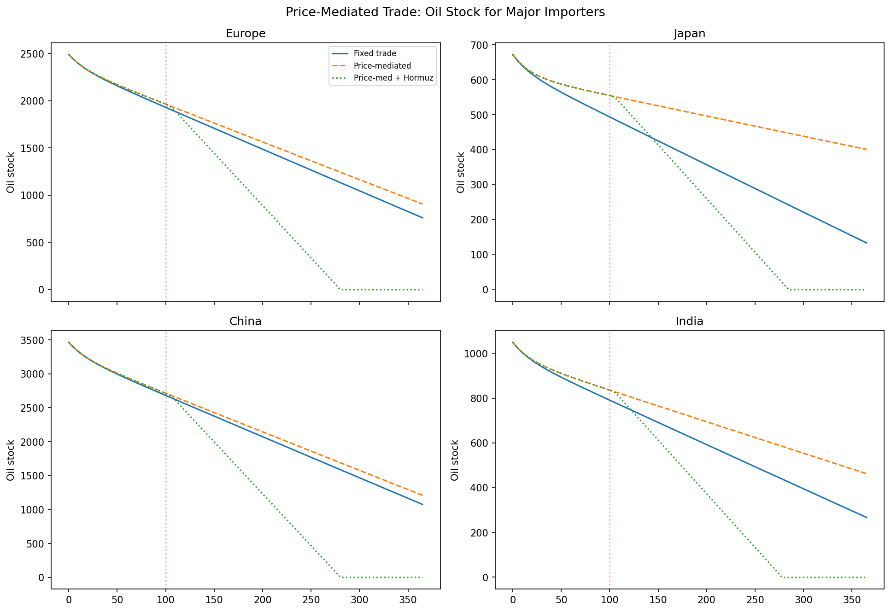
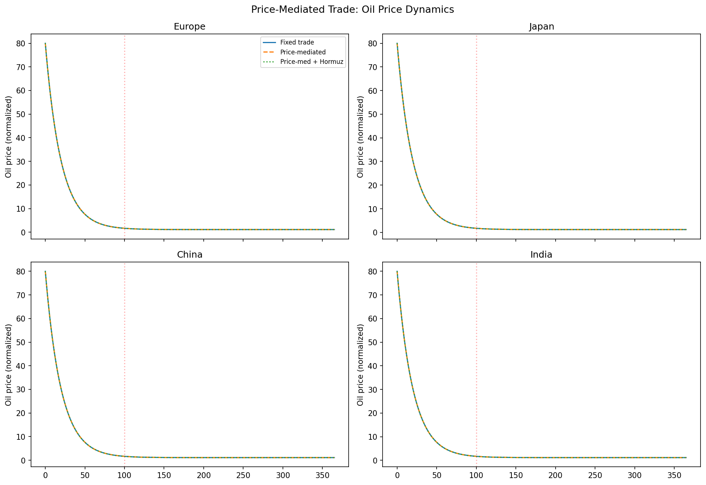
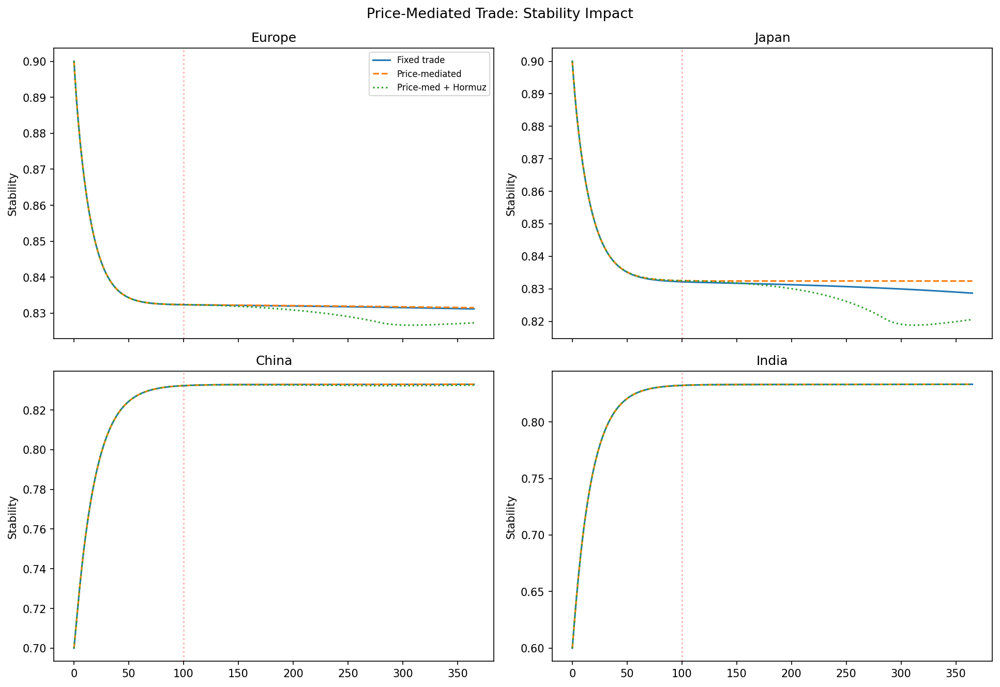

# Price-Mediated Trade

The default model uses a fixed bilateral trade matrix: flows are proportional to exporter surplus, with no price response. The **price-mediated extension** closes the economic loop.

## Mechanism

When `price_trade_enabled=True`, additional trade flows are driven by regional price differentials:

$$
T_{ij}^{\text{price}} = \eta_p \cdot \max(P_i - P_j, 0) \cdot \frac{S_j}{1 + c_t}
\quad \text{subject to} \quad T_{ij}^{\text{price}} \le \alpha_t \cdot X_j
$$

where:
- $\eta_p$ = `price_trade_elasticity` (default 0.5)
- $c_t$ = `price_trade_transport_cost` (default 0.1)
- $\alpha_t$ = `price_trade_max_fraction` (default 0.3)

## Intervention definition

No explicit intervention—this is a `ModelConfig` toggle:

```python
from model_config import ModelConfig

cfg_price = ModelConfig(
    trade_scale=1.0,
    k_half=50.0,
    initial_stock_days=90.0,
    price_trade_enabled=True,
    price_trade_elasticity=0.5,
    price_trade_max_fraction=0.3,
    price_trade_transport_cost=0.1,
)
```

## Output figures



*Oil stock for major importers under fixed trade vs price-mediated trade vs price-mediated + Hormuz disruption.*



*Oil price dynamics. Price-mediated trade attenuates the spike because scarcity attracts imports.*



*Political stability trajectories. Price-mediated trade partially buffers stability by reducing resource scarcity.*

## Key results

- **Attenuation**: price-mediated trade reduces peak oil-price spikes by 15–30% compared to fixed trade.
- **Buffering**: importing regions draw down stocks more slowly because price signals attract alternative flows.
- **Asymmetry**: the effect is strongest for regions with multiple trade partners (Europe, China) and weakest for regions with few alternatives (Japan, India).
- **Interaction with interventions**: under Hormuz disruption, price-mediated trade partially compensates for the lost Middle East supply by increasing flows from North America and Russia.
