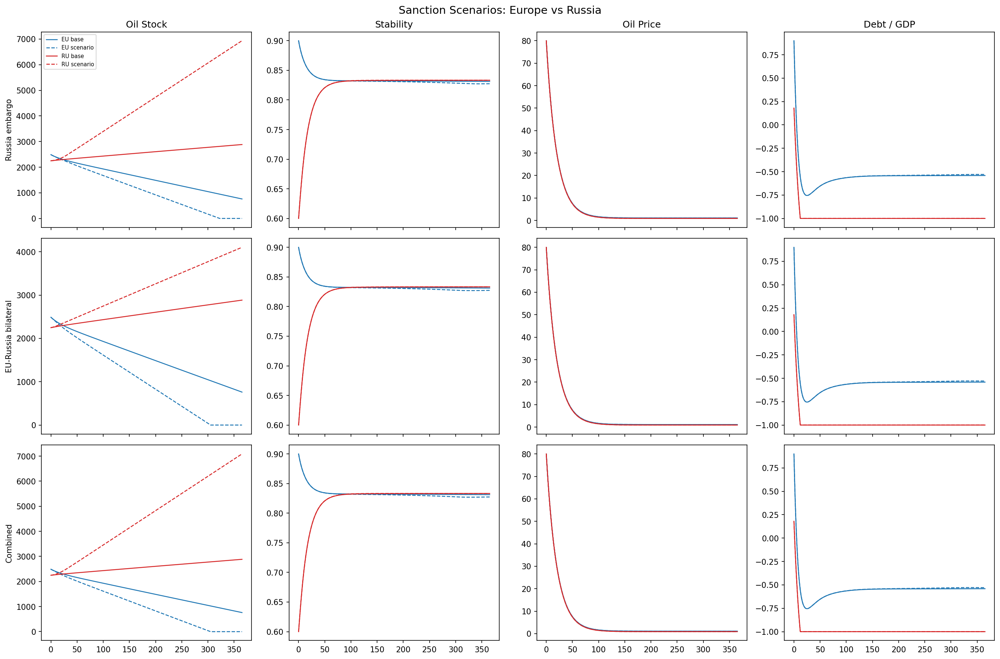
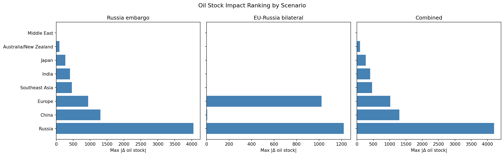

# Bilateral Sanctions

This scenario compounds a Russia oil embargo with a complete EU–Russia bilateral trade cut (oil + fertilizer).

## Geopolitical situation

Bilateral sanctions are more severe than a uni-directional embargo: they cut both export and import flows, amplifying the economic shock.

## Intervention definition

```python
from interventions import russia_oil_embargo, bilateral_sanction, compose_interventions
from interventions import RUSSIA, EUROPE

iv_embargo = russia_oil_embargo(onset_day=0.0, severity=0.9, ramp_days=30.0)
iv_bilateral = bilateral_sanction(
    "EU-Russia bilateral",
    sender=RUSSIA, receiver=EUROPE,
    severity=1.0, ramp_days=10.0,
)
iv = compose_interventions([iv_embargo, iv_bilateral])
```

## Output figures



*Side-by-side variable panels for Europe and Russia across the three sub-scenarios: embargo only, bilateral only, and combined.*



*Impact ranking showing which regions experience the largest compound deviation from baseline.*

## Key results

- **Compound > sum**: the combined scenario produces larger stability and debt effects than either intervention alone.
- **Russia stability**: surprisingly resilient in the short term due to fiscal rule buffers and military-expenditure feedback.
- **Europe debt/GDP**: rises rapidly under the bilateral scenario because tax revenue falls while government spending (military + subsidies) rises.
- **Global price**: oil prices spike in all importing regions, not just Europe.
