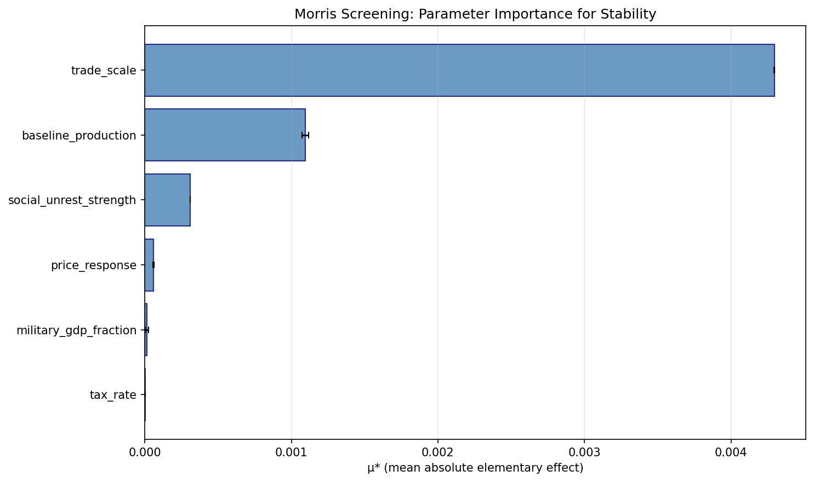
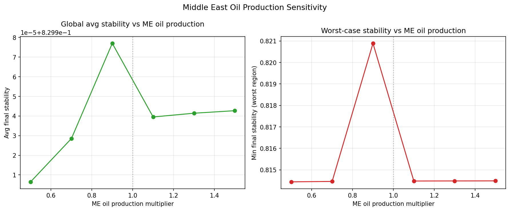
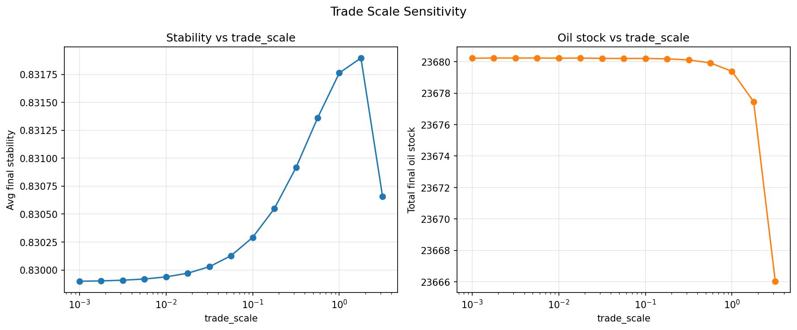

# Sensitivity Analysis

The `sensitivity.py` module provides two complementary methods for understanding which parameters drive model outcomes.

## Methods

### 1. Parameter sweep (`parameter_sweep`)

Grid-search a single `ModelConfig` coefficient over a range, holding everything else constant.

```python
from sensitivity import parameter_sweep
import numpy as np

values, metrics = parameter_sweep(
    param_name="trade_scale",
    values=np.linspace(0.005, 0.02, 20),
    metric="avg_stability",
)
```

Useful for:
- Bounding "reasonable" parameter ranges
- Checking monotonicity assumptions
- Generating response-surface plots

### 2. Morris screening (`morris_screening`)

The Morris one-at-a-time (OAT) elementary-effects method ranks parameters by their **mean elementary effect** (importance) and **standard deviation** (interactions / nonlinearity).

```python
from sensitivity import morris_screening

mu, sigma = morris_screening(
    config=ModelConfig(),
    param_levels=4,
    r=10,  # trajectories
    metric="avg_oil_price",
)
```

Interpretation:
- High μ, low σ → **important and linear**
- High μ, high σ → **important and nonlinear / interactive**
- Low μ, high σ → **unimportant but unstable** (check for numerics)
- Low μ, low σ → **unimportant**

## Figures

| Figure | Description |
|--------|-------------|
|  | Elementary-effect ranking |
|  | Parameter sweep: oil price vs. Middle-East disruption |
|  | Parameter sweep: trade-scale coefficient |

## Typical workflow

1. Run Morris screening on all ~60 `ModelConfig` fields → identify top 10 drivers.
2. Run parameter sweeps on those top 10 → quantify response curves.
3. Update `model_config.py` docstrings with observed "typical" ranges.

!!! tip
    Morris screening is cheap (~minutes for 60 parameters) because it uses a coarse grid. Use it before committing to expensive parameter sweeps or Monte-Carlo analyses.
